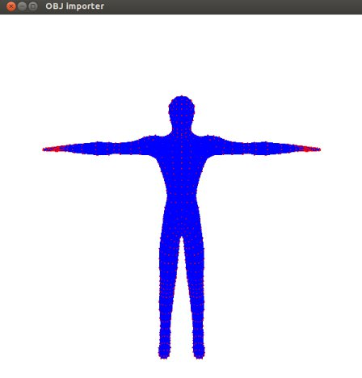

# OpenGL Object Importer Library

Library to import .obj files into OpenGL scenes.

## Features
* Support the drawing of the .obj vertices
* Support the drawing of the .obj simple faces

## Usage

The only think required is to import the __objImporter.h__. 
The functions are explained below are there is also a sample program __example.c__.

### Object declaration

Model humanModel;

### Object loading

// This will load the supported data from the obj file.

humanModel = loadModel("human.obj");

### Drawing funtions

// This function will draw the vertices of a loaded object. The first parameter is the vertice point size and the second is the object.

drawModelVertex(int , Model);

// This function only support simple faces yet. It accepts as the parameter an object and draw it's faces.

drawModelFaces(humanModel);

## Sample picture of an imported object

## Change Log
* 08-12-2015 - First version

## Acknowledgments
* human.obj model from opengameart.com
